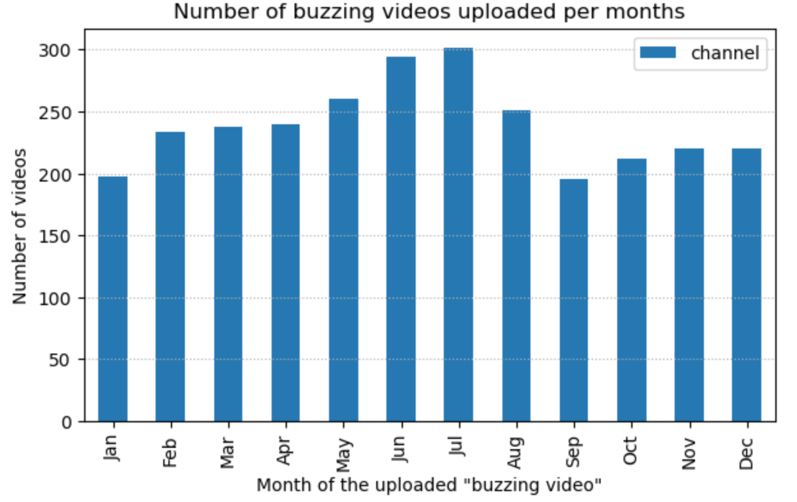
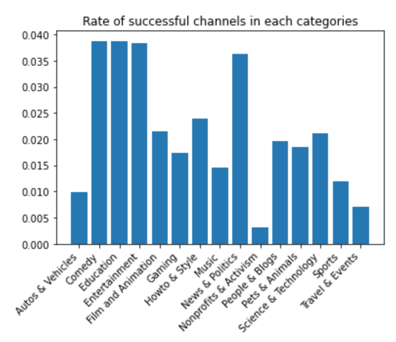

# CroquemADAme - YouNiverse : guiding manual to become famous on YouTube 
***
## Abstract
Nowadays, becoming a YouTuber is accessible to anyone with a smartphone and an Internet connection. Growing into a successful person on this platform is therefore the dream of many. However, this is not as easy as it seems. With the emergence of many users, it has become increasingly difficult to make your own place. Therefore, we would like to create a guideline for small YouTubers (our analysis is focus on youtubers that started with 10k to 15k subscribers) - how to choose the perfect video duration, what tags to use, the best contents, the best period to post, the perfect title to attract new viewers, etc. - to allow them to focus on the actual content with the certainty that other objective parameters are potentiating the success. 

## Table of Contents
1. [Research Questions](#research-questions)
2. [Methods](#methods)
3. [Proposed Timeline](#proposed-timeline)
4. [Organization within the team](#organization-within-the-team)
5. [Questions for TAs](#questions-for-tas)

## Research questions
***
* How to grow fast on YouTube ?
* What are the best objetive parameters of a video to improve performance ? 
* Do the title / category / length of video / tags / date of upload / frequency of upload play a role on channel growth?
* If so, what are most important parameters and their best values to improve channel growth? 
* Is there a parameter that has significantly more effect than the others ? 

## Methods
***

#### 1. Data Storage 
In <code>P2_preprocessing.ipynb</code> the following datasets are imported from [YouNiverse](https://github.com/epfl-dlab/YouNiverse):
- <code>df_channels_en.tsv.gz</code> (5,8 Mo)
- <code>df_timeseries_en.tsv.gz</code> (557,7 Mo)
- <code>_raw_yt_metadata.jsonl.zst</code> (14,3 Go)

<code>df_channel</code> and <code>df_timeseries</code> are filtered following the first point of [**2. Data processing**](https://github.com/epfl-ada/ada-2022-project-croquemadame#2-data-processing) and saved to new less voluminous files:
- <code>s_df_channels.tsv.zip</code> (134 Ko)
- <code>s_df_timeseries.tsv.zip</code> (12,3 Mo)

<code>_raw_yt_metadata</code> is decoded line by line using the <code>zstd</code> library and data from before 2015 and after 2019 is filtered out. We save the new DataFrame in 6 different parts of 10.000.000 videos each to have handleable files:
- <code>_raw_yt_metadata#.tsv.zip</code> (~720 Mo)

Each of the 6 files is filtered following the first point of [**2. Data processing**](https://github.com/epfl-ada/ada-2022-project-croquemadame#2-data-processing) as for <code>df_channels</code> and <code>df_timeseries</code> and save to new even smaller files:
- <code>s_metadata#.tsv.zip</code> (~26 Mo)

The 6 smaller files are grouped together to form one final file:

- <code>s_df_metadata.tsv.zip</code> (178,9 Mo)

We are making sure each final <code>s_df_file.tsv.zip</code> share the same channels.

#### 2. Data processing 
* Keeping YouTubers that grew a lot from 2015 to 2019: 

We will use YouTubers that correspond to the following criteria:
<10.000 subscribers in 2015 >1.000.000 subscribers in 2019

* Search for the buzzing video  

On this filtered dataset, the goal is to analyze YouTubers’ “buzzing” videos.
To do so, we keep YouTubers that had in their YouTube career a strong “slope” / rise of their channel subscribers (we can use delta_subs from the time_series dataset). For each YouTuber we assign a “buzzing date” where the delta_subs is the highest.
We are now left with YouTubers that have unexpectedly buzzed.

* Extracting buzzing videos 

We extract their “buzzing” videos, by looking at their videos 2 months preceding the buzzing date.
We keep all these videos in a dataset, and we should be left with a considerable amount of buzzing videos from different YouTubers that are now famous.

#### 3. Analysis of the data 

* **Analysis among categories** 
  * We first looked at the most popular category which is entertaintment and we decided to focused on it 

* **Comparison of the parameters of buzzing channels and quiet channels** 

Now we have channels that evolve a lot and other that did not. We will name them as buzzing and quiet channels. 
For each videos of each channel, we will compute the parameter analysis : 
- calculate the number of words in the title
- calculate number of tags 
- calculate if there is tags
- calculate if they used the lexical field of featuring in the title
- calculate if they used capital letters in the title
- calculate if they used pronouns(first person of singular, first person of plural, second person, third person of singular, third person of plural) in the title
- calculate if they used positive or negative words in the title
- The duration of the video
- Calculate the week frequency of uploaded videos 

Then we computed the mean of each channel of those parameters.

We then obtained a dataset with the following columns :
`mean_capital_title`,`mean_numwords`,`mean_feats`,`mean_duration`,`mean_numtags`,`mean_is_tags`,`week_freq`,`mean_first_person_singular`,`mean_first_person_plural`,`mean_second_person`,`mean_third_person_singular`,`mean_third_person_plural`,`mean_positive`,`mean_negative`

| channel   | mean_duration | mean_numwords| mean_capital_title | mean_feats | mean_numtags | mean_is_tags | week_freq | mean_positive | mean_negative | pronouns | has_buzzed |
|-----------|---------------|--------------|--------------------|------------|--------------|--------------|-----------|---------------|---------------|---------|----------|
| channel_a |    500        |     6        |       0.1          |    0.01    |     5        |     0.5      |    0.5    |       0.4     |     0.8       |    0.2    |    0    |
| channel_b |    600        |     10       |       0.3          |    0.005   |     7        |     0.8      |     1.5   |       0.9     |     0.3       |   0.7    |    1    |
| channel_c |    650        |     13       |       0.2          |    0.02    |     9        |     0.7      |      3    |       0.7     |     0.2       |    0.5    |    1    |

* **Importance of features**

  * We will compute a random tree to see which feature is the most importance 
  * We will then compute t-test on each parameters to see wich one is significant for our analysis
  * We will also compute linear regression on the most important features 

* **Analysis of the tags**
  * Compute the most used tags for the buzzing and non buzing channels 

* **Lexical analysis on the title** 
  * Analyse the topics for the title of buzzing channels and quiet ones 
  * Venn diagram of the 15 most used topics to see with ones are specific to the buzzing and quiet channels 
  * Wordcloud of the most used words on the title 

* **Analysis of the better period to post a video**
  * Plot of the number of views in function of the month of the year for the videos of buzzing videos. 
  * It will give an idea of interest of spectators in function of the period.

#### 4. Visualization 

* Plot of the categories popularity

* Plot of a youtuber (an example) : evolution of delta_subs, evolution of subscribers 

* Plot of the features importances 

* Boxplot of the parameters for buzzing and quiet channels 

* Plot of the topics in the title 

* Venn diagram of the most used topics for buzzing and quiet channels 

* Plot of the most used tags 

* Wordcloud of the most used words in title 

* Histogram of the upload_date of the buzzing video in function of the months
 

#### 5. GitHub site building and data story redaction.

## Proposed Timeline
***
18.11.22 P2 deadline

- Small data analysis

02.12.22 Homework 2 deadline

06.12.22 Do the final analysis

10.12.22 Begin of the redaction of the data story

14.12.22 Finish the code and visualizations 

19.12.22 Finish datastory

23.12.22 Milestone 3 deadline

## Organization within the team
***
A list of internal milestones up until project Milestone P3.
* Ludovic : Data analysis (Comparison, Anova), visualization
* Margaux Z : Data story and web site building 
* Carolina : Data story and web site building
* Margaux R : Data analysis (Title, categories), visualization

## Questions for TAs
***
* Is it better to do a comparison test (t-test) on a sample with the most viewed video of each YouTuber and a sample with the least viewed video ? Or is our AB_test good?
