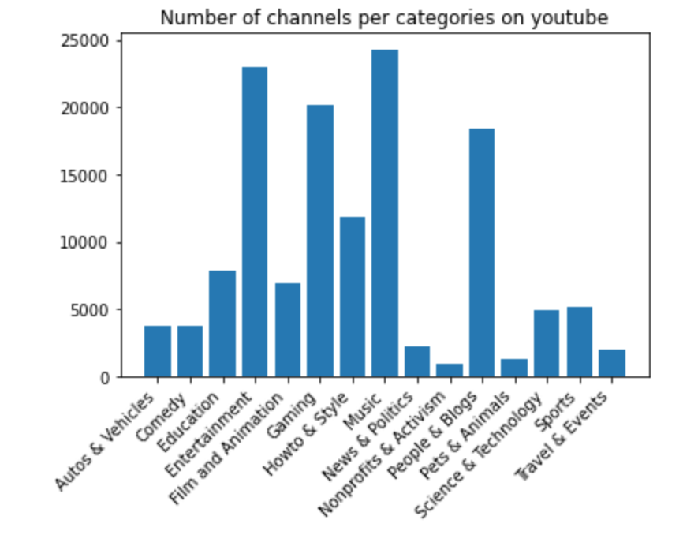
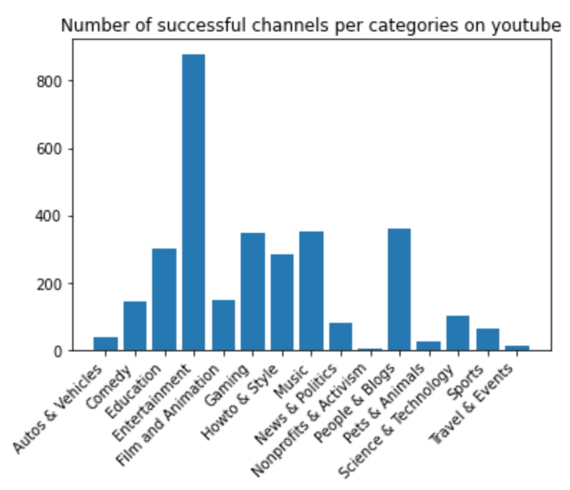
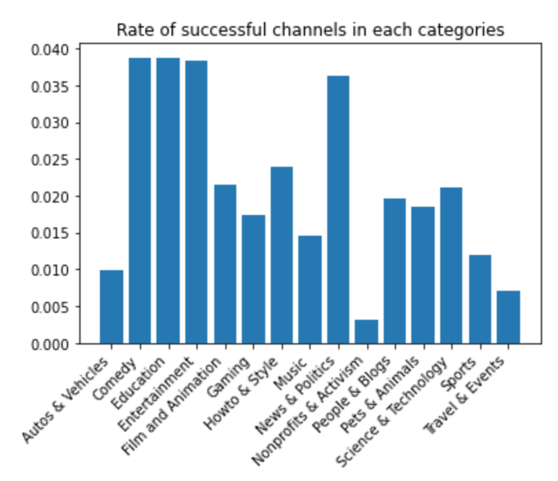

# CroquemADAme - YouNiverse : guiding manual to become famous on YouTube 
***
## Abstract
Nowadays, becoming a YouTuber is accessible to anyone with a smartphone and an Internet connection. Growing into a successful person on this platform is therefore the dream of many beginners. However, this is not as easy as it seems. With the emergence of many users, it has become increasingly difficult to make your own place. Therefore, we would like to create a guideline for every starting YouTuber - how to evaluate the perfect length of a video, what tags to use, the best contents/categories, the best period to post, the perfect title to attract, etc. - to allow them to focus on the right parameters to succeed on YouTube. 

## Table of Contents
1. [Research Questions](#research-questions)
2. [Methods](#methods)
3. [Proposed Timeline](#proposed-timeline)
4. [Organization within the team](#organization-within-the-team)
5. [Questions for TAs](#questions-for-tas)

## Research questions
***
* How to become famous on YouTube ?
* What is the perfect video to post to have the most views ? 
* Do the title / category / length of video / tags / date of upload / frequency of upload play a role on becoming famous?
* If so, what are best parameters? 
* Do the parameters change among a category ? 
* Is there a parameter that has more effect than the others ? 

## Methods
***

#### 1. Data Storage 
In <code>P2_preprocessing.ipynb</code> the following datasets are imported from [YouNiverse](https://github.com/epfl-dlab/YouNiverse):
- <code>df_channels_en.tsv.gz</code> (5,8 Mo)
- <code>df_timeseries_en.tsv.gz</code> (557,7 Mo)
- <code>_raw_yt_metadata.jsonl.zst</code> (14,3 Go)

<code>df_channel</code> and <code>df_timeseries</code> are filtered following the first point of [**2. Data processing**](https://github.com/epfl-ada/ada-2022-project-croquemadame#2-data-processing) and saved to new less voluminous files:
- <code>s_df_channels.tsv.zip</code> (134 Ko)
- <code>s_df_timeseries.tsv.zip</code> (12,3 Mo)

<code>_raw_yt_metadata</code> is decoded line by line using the <code>zstd</code> library and data from before 2015 and after 2019 is filtered out. We save the new DataFrame in 6 different parts of 10.000.000 videos each to have handleable files:
- <code>_raw_yt_metadata#.tsv.zip</code> (~720 Mo)

Each of the 6 files is filtered following the first point of [**2. Data processing**](https://github.com/epfl-ada/ada-2022-project-croquemadame#2-data-processing) as for <code>df_channels</code> and <code>df_timeseries</code> and save to new even smaller files:
- <code>s_metadata#.tsv.zip</code> (~26 Mo)

The 6 smaller files are grouped together to form one final file:

- <code>s_df_metadata.tsv.zip</code> (178,9 Mo)

We are making sure each final <code>s_df_file.tsv.zip</code> share the same channels.

#### 2. Data processing 
* Keeping YouTubers that grew a lot from 2015 to 2019: 

We will use YouTubers that correspond to the following criteria:
<10.000 subscribers in 2015 >1.000.000 subscribers in 2019

* Search for the buzzing video  

On this filtered dataset, the goal is to analyze YouTubers’ “buzzing” videos.
To do so, we keep YouTubers that had in their YouTube career a strong “slope” / rise of their channel subscribers (we can use delta_subs from the time_series dataset). For each YouTuber we assign a “buzzing date” where the delta_subs is the highest.
We are now left with YouTubers that have unexpectedly buzzed.

* Extracting buzzing videos 

We extract their “buzzing” videos, by looking at their videos 2 months preceding the buzzing date.
We keep all these videos in a dataset, and we should be left with a considerable amount of buzzing videos from different YouTubers that are now famous.

#### 3. Analysis of the data 

* **Comparison of the parameters of most viewed video and less viewed** 

Now we will create pairs comparing the videos of a same YouTuber. For example, if a youtuber uploaded 3 videos during the period preceding the buzz date, we will have a DataFrame as follows:

| channel   | winning_video | views1    | losing_video | views2  |
|-----------|---------------|-----------|--------------|---------|
| channel_a | video1        | 500.000   | video2       | 10.000  |
| channel_a | video3        | 1.000.000 | video1       | 500.000 |
| channel_a | video3        | 1.000.000 | video2       | 10.000  |

We create a table with the parameters of the losing and winning videos, and we do some t-tests on the parameters (duration of the video, number of tags, etc.) to see if there is an effect on those parameters for the winning videos and losing videos. 

| channel   | winning_video | views1    | losing_video | views2  | duration1   | duration2 | 
|-----------|---------------|-----------|--------------|---------|-------------|-----------|
| channel_a | video1        | 500.000   | video2       | 10.000  |  680        |    500    |
| channel_a | video3        | 1.000.000 | video1       | 500.000 |  720        |    560    |
| channel_a | video3        | 1.000.000 | video2       | 10.000  |  700        |    490    |
| channel_b | video1        | 600.000   | video2       | 20.000  |  650        |    470    |
| channel_b | video3        | 1.200.000 | video1       | 600.000 |  710        |    530    |
| channel_b | video3        | 1.200.000 | video2       | 20.000  |  730        |    500    |

-> Which parameter has the strongest effect?

Histogram of the number of uploaded videos per month 

Histogram of the tags used 

* **Detailed analysis on the title** 

We will create a data set with the information on the title: 

| channel   | winning_video | views1    | losing_video | views2  | Length1   | length2 | Capital Letter1 |Capital Letter2 | Number1 | Number2 | Feat1 | Feat2 |
|-----------|---------------|-----------|--------------|---------|-----------|---------|-----------------|----------------|---------|---------|-------|-------|
| channel_a | video1        | 500.000   | video2       | 10.000  |  680      |    500  |       1         |       1         |   1     |   0     |    1  |    0  |
| channel_a | video3        | 1.000.000 | video1       | 500.000 |  720      |    560  |       1         |       0         |   0     |   1     |    0  |    0  |
| channel_a | video3        | 1.000.000 | video2       | 10.000  |  700      |    490  |       0         |       0         |   1     |   1     |    0  |    0  |

Length : the number of words used in the title 

Capital Letter : If there is at least one word (with at least 3 letters) written in capital letters ->1

Number : If there is at least one number in the title -> 1

Feat : We create a dictionary of words use when the video is in collaboration is another YouTuber ('feat', 'collab', 'with', 'ft', 'w/'...) if the title uses one of these words -> 1 

* **Compilation of the best combination of parameters**

We will perform ANOVA tests to compute the best combination of parameters.

* **Analysis among categories**

We can do the same analysis as above within each category. This way a youtuber that aims at posting gaming videos, for example, will have a personalized guideline.

#### 4. Visualization 

* Plot of a youtuber (an example) : evolution of delta_subs, evolution of subscribers 

* Histogram of the number of channels in function of the upload_date of the buzzing video 

* Histogram of the upload_date of the buzzing video

* Histogram of the tags used 

* Categories : 
  
  * Histogram of the number of channels per categories (in <code>P2_preprocessing.ipynb</code>)
  
  

  * Histogram of the number of successful channels per categories (in <code>P2_preprocessing.ipynb</code>)
  
  
  
  * Histogram of the rate of successful channels in each category (in <code>P2_preprocessing.ipynb</code>)
  
  
  
  

#### 5. GitHub site building and data story redaction.

## Proposed Timeline
***
18.11.22 P2 deadline

- Small data analysis

02.12.22 Homework 2 deadline

06.12.22 Do the final analysis

10.12.22 Begin of the redaction of the data story

14.12.22 Finish the code and visualizations 

19.12.22 Finish datastory

23.12.22 Milestone 3 deadline

## Organization within the team
***
A list of internal milestones up until project Milestone P3.
* Ludovic : Data analysis (Comparison, Anova), visualization
* Margaux Z : Data story and web site building 
* Carolina : Data story and web site building
* Margaux R : Data analysis (Title, categories), visualization

## Questions for TAs
***
* Is it better to do a comparison test (t-test) on a sample with the most viewed video of each YouTuber and a sample with the least viewed video ? Or is our AB_test good?
